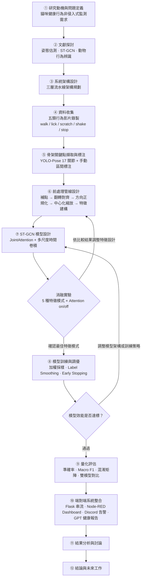

# 📘 貓咪行為辨識系統 — 論文進度匯報框架

> [!IMPORTANT]
> **本文件用途**
>
> 論文進度匯報用的框架文件，涵蓋問題定義、研究方法、系統架構、消融實驗設計與目前進度——是敘事版的專案總覽，不是逐行程式碼文件。
>
> **系統名稱：** 貓咪行為辨識系統　|　**學生：** 資工碩士生
>
> **更新日期：** 2026-07-15（部分內容已於 2026-08-11 核對修正，見文中個別標註；核對範圍限於本次發現的具體錯誤，非全文重寫）

---

## 🚀 30 秒快速看懂（TL;DR）

> [!TIP]
> ### 如果只看一頁，請看這裡
>
> - 🎯 **目標**：用普通攝影機做貓咪行為辨識（walk/lick/scratch/shake/stop），不干擾貓咪、及早發現健康異常。
> - 🏗️ **架構**：三層流水線——感知層（YOLO-Pose）→ 分析層（ST-GCN）→ 監測層（統計／推送／GPT 報告）。
> - 🧪 **核心貢獻**：針對動物骨架設計的前處理管線 ＋ JointAttention 關節注意力 ＋ 5 種特徵通道消融實驗。
> - ✅ **目前狀態**：核心系統與消融實驗皆已完成，SQA（骨架品質雙重判定）已啟用，論文撰寫進行中。
> - 🚨 **本文件校對狀態**：主體內容寫於 2026-07-15，2026-08-11 補了幾處核對修正（見各節內的標註），**不是全文重新校對過**。

---

## ⭐ 核心重點總結

> 五句話講完整份文件在說什麼：

- ⭐ 系統走**三層流水線架構**：感知層（YOLO-Pose 擷取 17 關鍵點）→ 分析層（ST-GCN 分類 5 種行為）→ 監測層（統計、記錄、推送、視覺化）。
- ⭐ 前處理管線（補點 → 翻轉對齊 → 方向正規化 → 中心化縮放 → 特徵建構）是**針對動物骨架設計的核心貢獻**，訓練與推論共用同一套，且**順序不可更動**。
- ⭐ 消融實驗系統性比較 5 種特徵通道組合（`xy` 到 `xy_conf_v_bone_bmotion`，2～9 channel）與 Attention on/off，找出最佳特徵設計。
- ⭐ 骨架品質雙重判定（SQA）是 ST-GCN 之外的獨立幾何合理性檢查層，**2026-08-11 起預設開啟**，「GCN 分類為主、幾何判斷為輔」，fail-safe 設計不影響主系統穩定性。
- ⭐ 端對端系統已整合 Flask 串流、Node-RED Dashboard、Discord 告警、GPT 健康報告，形成完整監測閉環；目前主要剩論文撰寫與少數未來工作項目（多貓追蹤、邊緣裝置部署等）。

---

## 📖 如何使用本文件（標示說明）

| 標示 | 意義 |
|:---:|---|
| 🚨 | 必看、容易踩坑／文件已知過時處 |
| ⚠️ | 注意事項 |
| 💡 | 重點整理 |
| ✅ | 已完成／最佳做法 |
| 🔄 | 進行中 |
| 🧠 | 原理解析 |
| 📌 | 本節結論 |
| ⭐ | 核心重點 |
| 📎 | 延伸閱讀／相關檔案 |
| 📋 | Cheat Sheet |

---

## 🧭 快速導航（目錄）

1. [🎯 一、問題定義（Problem Definition）](#一問題定義problem-definition)
2. [🎓 二、研究目的（Research Objectives）](#二研究目的research-objectives)
3. [🏗️ 三、研究方法（Research Methodology）](#三研究方法research-methodology)
   - [3.1 整體方法論](#31-整體方法論)
   - [3.2 感知層（Perception Layer）](#32-感知層perception-layer)
   - [3.3 分析層（Analysis Layer）](#33-分析層analysis-layer)
   - [3.4 監測層（Monitoring Layer）](#34-監測層monitoring-layer)
   - [3.5 消融實驗設計（Ablation Study）](#35-消融實驗設計ablation-study)
   - [3.6 🚨 Skeleton Quality Assessment（骨架品質雙重判定）](#36-skeleton-quality-assessment骨架品質雙重判定2026-07-新增)
4. [🗺️ 四、研究流程（Research Flow）](#四研究流程research-flow)
5. [✅ 五、目前進度摘要](#五目前進度摘要)
6. [📋 六、關鍵參數一覽（Cheat Sheet）](#六關鍵參數一覽)
7. [⭐ 七、系統貢獻摘要（給報告使用）](#七系統貢獻摘要給報告使用)
8. [🔭 八、未來工作方向](#八未來工作方向)

---

<a id="sec-1"></a>
## 一、問題定義（Problem Definition）

> 📖 **一句話摘要**：家貓健康異常早期難察覺，本研究要用普通攝影機做非侵入式、全天候的行為辨識來補這個缺口。

<a id="sec-1-1"></a>
### 1.1 研究背景與動機

現代家庭貓咪的健康監測多依賴飼主的主觀觀察，缺乏客觀、連續且非侵入式的量測手段。貓咪不善於表達疼痛，許多行為異常（如過度舔舐、搖頭、活動力驟降）在早期往往被忽略，導致就醫時病情已進展。

<a id="sec-1-2"></a>
### 1.2 問題陳述

如何在不干擾貓咪的前提下，僅透過普通攝影機對貓咪進行全天候行為辨識，並於異常行為發生時自動發出預警？

<a id="sec-1-3"></a>
### 1.3 核心挑戰

| 挑戰 | 說明 |
|---|---|
| 骨架遮蔽與缺失 | 貓咪自我理毛、蜷縮等姿態造成關鍵點遮蔽 |
| 動作邊界模糊 | 行為類別間存在過渡動作，無明確切分點 |
| 個體差異 | 不同品種體型、毛色差異影響姿態估測穩定性 |
| 即時性需求 | 系統需在消費級硬體上達到接近即時的推論速度 |

---

<a id="sec-2"></a>
## 二、研究目的（Research Objectives）

> 📖 **一句話摘要**：建一套 YOLO-Pose + ST-GCN 的行為辨識管線，用消融實驗驗證特徵設計，再整合成端對端監測系統。

1. 建構一套基於 YOLO-Pose + ST-GCN 的**非侵入式貓咪行為辨識管線**。
2. 設計並評估針對動物骨架特性的**時空前處理策略**（補點、翻轉對齊、方向正規化）。
3. 透過**消融實驗**比較五種特徵通道設計對辨識精度的影響：
   - `xy`（2ch）、`xy_conf`（3ch）、`xy_conf_v`（5ch）、`xy_conf_v_bone`（7ch）、`xy_conf_v_bone_bmotion`（9ch）
4. 整合**端對端即時監測系統**，包含行為統計、健康警示推播與 GPT 自然語言健康分析。

---

<a id="sec-3"></a>
## 三、研究方法（Research Methodology）

<a id="sec-3-1"></a>
### 3.1 整體方法論

> 📖 **一句話摘要**：三層流水線架構，所有參數集中在 `config.py`，確保訓練與推論設定一致。

本研究採用**三層流水線架構（Three-Layer Pipeline Architecture）**：

```
感知層（Perception Layer）
    → 分析層（Analysis Layer）
        → 監測層（Monitoring Layer）
```

所有參數統一集中於 `config.py`，確保訓練與推論設定一致。

---

<a id="sec-3-2"></a>
### 3.2 感知層（Perception Layer）

> 📖 **一句話摘要**：YOLO-Pose 擷取 17 個關鍵點，EMA 平滑後進 buffer，經過本研究設計的前處理管線才送進 ST-GCN。

**Frame 擷取**
- `cv2.VideoCapture` 讀取 MP4 / RTSP / 攝影機
- 降採樣至 30 FPS（`TARGET_MODEL_FPS`）

**骨架關鍵點偵測**
- YOLO-Pose（FP16 GPU 加速，imgsz=640，conf ≥ 0.5）
- 輸出：17 個關鍵點座標 `kpts (17, 2)` 與信心值 `kpt_conf (17,)`
- 貓體骨架關鍵點重映射（COCO 17 點 → 貓體解剖位置）：

| 索引 | 名稱 | 部位 |
|:---:|---|---|
| 0 | nose | 鼻尖 |
| 1 | left_ear_tip | 左耳尖 |
| 2 | right_ear_tip | 右耳尖 |
| 3 | chest | 前胸 |
| 4 | mid_back | 背中（翻轉與方向正規化基準點） |
| 5 | hip | 髖部（尺度縮放基準） |
| 6–9 | 前肢（左右肘、爪） | 前肢 |
| 10–13 | 後肢（左右膝、爪） | 後肢 |
| 14–16 | tail_base / tail_mid / tail_tip | 尾巴 |

> [!NOTE]
> **⚠️ ST-GCN 實際僅使用前 14 個關鍵點**（`STGCNConfig.NUM_JOINTS = 14`）。YOLO-Pose 仍輸出完整 17 點，但推論管線（`behavior_classifier.py`）會截斷尾巴三點（14 tail_base / 15 tail_mid / 16 tail_tip）後才送入 ST-GCN；此截斷邏輯與訓練設定 `stgcn_config.yaml` 的 `NUM_JOINTS` 一致，屬消融實驗保留下來的最終設計（捨棄尾巴點以提升穩定性）。

**EMA 平滑**
- 以指數移動平均（EMA，α = 1.0）平滑逐幀關鍵點
- 平滑後的關鍵點用於 overlay 顯示與異常偵測

**時間序列 Buffer**
- `deque(maxlen=T=16)` 累積連續 16 幀原始關鍵點（`SEQUENCE_LENGTH`）
- 緩衝區填滿後，每隔 `WINDOW_STRIDE` 幀觸發一次 ST-GCN 推論（推論步長，定義於 `config.py`，預設 = **2** 幀，非窗長 16）
- 訓練時的 `WINDOW_STRIDE = 8`（50% 重疊，定義於 `stgcn_config.yaml`），與推論步長各自獨立

**前處理管線（訓練與推論共用）**

> [!IMPORTANT]
> 🧠 此管線為本研究針對動物骨架設計的**核心貢獻**，順序不可更動。

1. `interpolate_missing()` — 低信心關鍵點（conf < 0.5）做時序插值補點
2. `flip_normalize()` — 以 mid_back / hip 為基準做左右翻轉對齊，使骨架朝向一致
3. `orientation_normalize()` — 旋轉軀幹主軸至固定方向，消除姿態朝向差異
4. `normalize_skeleton_coords()` — 以 mid_back 為原點中心化，以胸-髖距為尺度縮放
5. `build_feature_tensor()` — 依 `FEATURE_MODE` 組合通道，排列為 `(N=1, C, T=16, V=14)`（V 依實際使用的關鍵點數，即截斷尾巴後的 14 點）

> 📌 **本節結論**：感知層負責「擷取 → 平滑 → buffer → 五步驟前處理」，輸出固定形狀的 `(N,C,T,V)` tensor 給分析層；14 關節截斷與前處理順序是刻意設計，訓練/推論兩端共用同一套函式確保一致性。

---

<a id="sec-3-3"></a>
### 3.3 分析層（Analysis Layer）

> 📖 **一句話摘要**：ST-GCN 主幹（JointAttention + 3 個 Block 的空間圖卷積/多尺度時間卷積）把關鍵點序列分類成 5 種行為，信心 <0.80 一律視為 LOW_CONF。

**ST-GCN 模型架構**

```
輸入 (N=1, C, T=16, V=14)          ← V 依 checkpoint 的關節點數自動偵測，目前部署模型為 14（捨棄尾巴 3 點）
    │
    ├── BatchNorm2d(C)
    └── JointAttention
          Conv2d(C→1) + Sigmoid → weight (N,1,T,V)
          x = bn_x × attn  （per-joint per-frame attention）
    │
    ├── Block 1  SpatialGraphConv(C→64, K=3)
    │            MultiScaleTemporalConv(k=3,5,9, stride=1)
    │            output: (N, 64, T=16, V=14)
    │
    ├── Block 2  SpatialGraphConv(64→128, K=3)
    │            MultiScaleTemporalConv(k=3,5,9, stride=2)
    │            output: (N, 128, T=8, V=14)  ← T 降採樣
    │
    ├── Block 3  SpatialGraphConv(128→128, K=3)
    │            MultiScaleTemporalConv(k=3,5,9, stride=1)
    │            output: (N, 128, T=8, V=14)
    │
    └── AdaptiveAvgPool2d(1,1) → Dropout → Linear(128→5) → Softmax
        probs: [walk, lick, scratch, shake, stop]
```

**空間圖卷積（K=3 分組）**
- A_root（自連結）、A_close（1-hop 直接鄰居）、A_further（2-hop 兩步鄰居）
- 各分組重要性為可學習參數（partition_importance）

**多尺度時間卷積**
- 三分支 k=3,5,9，分支權重以 softmax 可學習加權

**信心門檻判定**
- `confidence = max(probs)`
- confidence ≥ 0.80 → 輸出行為標籤（walk / lick / scratch / shake / stop）
- confidence < 0.80 → 輸出 LOW_CONF（顯示為「正常」，不給行為標籤）

> 📌 **本節結論**：ST-GCN 是「空間圖卷積 + 多尺度時間卷積 + JointAttention」的組合架構，輸出 5 類行為機率，用固定 0.80 門檻決定要不要給出標籤。

---

<a id="sec-3-4"></a>
### 3.4 監測層（Monitoring Layer）

> 📖 **一句話摘要**：ST-GCN 分類結果之後的所有事——統計、幾何雙重驗證、記錄、推送、視覺化、對外通報——都在這一層完成。

| 元件 | 功能 |
|---|---|
| `BehaviorTracker` | 行為轉換偵測、時間累積、次數統計、今日統計（today_stats） |
| `AnomalyDetector` | 關鍵點位移（body_fraction×100 正規化、排除尾巴關節 14–16）計算活動力分數；30 幀滾動均值低於 STILL_MOTION_THRESHOLD 判為靜止；EMA α=1.0（預設不平滑） |
| `skeleton_quality_assessment.evaluate_window()` | 「GCN 分類為主、幾何判斷為輔」雙重判定（見[3.6](#sec-3-6)）：3 項骨架幾何指標判斷該推論窗口是否可信，不可信時覆蓋分類結果為 LOW_CONF；總開關 `SQAConfig.ENABLE_SQA_DUAL_JUDGMENT` **預設開啟**（2026-08-11 使用者確認為刻意變更，取代原本「預設關閉、待驗證後啟用」的規劃） |
| `CSVLogger` | 行為事件時間序列記錄（cat_monitoring_log.csv） |
| `NodeRedClient` | 每 0.5 秒同時 POST `/yolo_result_v2`（v2 主要）與 `/yolo_result`（v1 相容）推送行為資料到 Node-RED |
| `Visualizer` | 骨架連線、關鍵點、bbox、行為標籤、機率條 overlay |
| `LickStagePlugin` | 以鼻尖位置判斷貼近身體的區域（BODY/FL/FR/HL/HR），追蹤朝向狀態並統計各區域舔舐次數；結果 POST 至 Node-RED `/lick_zone_result`；`SHOW_NOSE_TRAPEZOID` 控制鼻部接觸梯形 overlay 顯示（`plugins/lick_stage/`） |
| `ExtBodyZonePlugin` | 擴充版 7 區身體分區偵測（`plugins/lick_stage/ext_body_zones/`），與 `LickStagePlugin` 並行註冊 |
| Flask `/stream` | MJPEG 即時串流（JPEG quality=30，約 30 FPS） |
| Flask 其他端點 | `/snapshot`（單張截圖）、`/video_clip`（ring buffer 影片片段擷取）、`/api/behavior_history`、`/api/overlay`（即時切換骨架/標籤/bbox overlay 顯示） |
| Node-RED Dashboard | 即時狀態卡片、行為時間軸、詳細統計、健康警示、活動力儀表 |
| Discord Webhook | 異常行為自動告警推播 |
| GPT API | 讀取 `C:\a\noda_data.csv`，以 gpt-4.1-mini 生成繁體中文健康分析報告；透過 **Facebook Messenger Webhook**（`/messengerwebhook`）接收指令（哈基米觸發報告 / `/camera` / `/help`）；以獨立 Node-RED Tab「CSV AI分析系統」實作（預設 disabled，需手動啟用），定義於 `GPT 健康報告.json` |

> [!NOTE]
> ✅ 2026-07 更新：原本 `GPT 健康報告.json` 中的 `/status` 指令節點會呼叫 Flask 不存在的 `/status` 路由並持續失敗，已將該指令節點（switch 規則、對應請求/回覆節點、`/help` 說明文字）整個移除，不再需要補路由。

> 📌 **本節結論**：監測層有 10+ 個元件並行運作，核心是 `BehaviorTracker`（統計）+ SQA（幾何驗證）雙保險，外加 CSV/Node-RED/Discord/GPT 四條對外輸出管道。

---

<a id="sec-3-5"></a>
### 3.5 消融實驗設計（Ablation Study）

> 📖 **一句話摘要**：5 種特徵通道（2~9ch）× Attention on/off 的消融實驗，用離散準確率/Macro F1/混淆矩陣評估，訓練策略走標準組合（加權採樣＋Label Smoothing＋Early Stopping）。

**特徵通道比較**

| 實驗組 | FEATURE_MODE | 通道數 | 特徵內容 |
|---|---|:---:|---|
| Baseline | `xy` | 2 | x, y |
| +信心值 | `xy_conf` | 3 | x, y, conf |
| +速度 | `xy_conf_v` | 5 | x, y, conf, vx, vy |
| +骨段向量 | `xy_conf_v_bone` | 7 | x, y, conf, vx, vy, bone_x, bone_y |
| +骨段速度 | `xy_conf_v_bone_bmotion` | 9 | x, y, conf, vx, vy, bone_x, bone_y, bone_mx, bone_my |

**Attention 對照組**
- 訓練期由 `stgcn_config.yaml` 的 `USE_ATTENTION` 欄位控制是否啟用 JointAttention（消融實驗對照組：on vs. off）
- 推論期不讀環境變數，而是由 `stgcn_model.py` 自動偵測 checkpoint 中是否含 `joint_attention.*` 權重來決定是否套用 Attention

**評估指標**

| 指標 | 說明 |
|---|---|
| 離散準確率（Discrete Accuracy） | argmax == true label 的比例（硬指標） |
| 真實類別平均機率（Soft Accuracy） | 真實類別的平均預測機率（信心度量） |
| Overall Accuracy | 整體正確率 |
| Macro F1 | 各類別 F1 之未加權平均（處理類別不平衡） |
| 混淆矩陣 | Row-wise recall 正規化顯示，直觀看類別間的混淆 |

**訓練策略**
- 類別加權採樣（Weighted Sampler）
- Label Smoothing
- 學習率調度（LR Scheduler）
- Early Stopping（patience = 10）
- 隨機種子固定（seed = 42）

---

<a id="sec-3-6"></a>
### 3.6 Skeleton Quality Assessment（骨架品質雙重判定，2026-07 新增）

> 📖 **一句話摘要**：ST-GCN 分類器不會自己懷疑骨架是不是誤檢，SQA 額外算 3 個幾何指標當第二層把關，不可信就覆蓋成 LOW_CONF；2026-08-11 起改為預設開啟。

**動機**：ST-GCN 分類器本身無法區分「這個窗口的骨架偵測是否合理」——即使 YOLO-Pose 因背景誤檢（棉被、枕頭、家具紋理）或關鍵點嚴重飄移產生不合理的骨架，分類器仍可能給出高信心但錯誤的行為標籤。此模組作為 ST-GCN 之外的獨立幾何合理性檢查，設計原則是「GCN 分類為主、幾何判斷為輔」——只在幾何指標明確判定不可信時才覆蓋分類結果，不取代 ST-GCN 本身。

**3 項幾何指標**（皆取自同一個 ST-GCN 推論窗口的原始關鍵點，不需額外資料）：

| 指標 | 計算方式 | 異常方向 |
|---|---|---|
| `midback_offset_ratio` | MidBack 偏離 Chest-Hip 虛擬中點的距離 ÷ Chest-Hip 距離 | 越大越可疑 |
| `midback_angle` | Chest-MidBack-Hip 夾角（窗口最後一幀） | 過度接近 180 度（近乎共線）或過小（過尖）皆可疑 |
| `body_axis_score_jitter` | 身體主軸比例分數（Chest-MidBack/MidBack-Hip 比例與參考值的偏差換算而成）在窗口內的振幅 | 振幅越大越可疑 |

**校準現況**：門檻值最初僅用少量影片（`tools/test_bone_length_stability.py` 模式3 建立的正常骨架基準 + 個位數支已知異常影片）粗略校準，整合進推論管線 `processors/frame_processor.py` 時一度規劃總開關 `config.py::SQAConfig.ENABLE_SQA_DUAL_JUDGMENT` 預設關閉、待更多影片驗證覆蓋規則後再手動開啟。

> [!NOTE]
> 🚨 **2026-08-11 更新**：`ENABLE_SQA_DUAL_JUDGMENT` 現在**預設開啟**，經使用者確認為刻意變更，取代上一段「預設關閉」的原始規劃。門檻本身是否有額外擴大驗證覆蓋範圍（不只前述少量影片）不在這次確認範圍內，仍以本節「校準現況」描述為準；如果之後有補做更大規模驗證，回頭補這一段。

**容錯設計**：`evaluate_window()` 保證不拋出例外（任何內部錯誤一律回傳「可信、不覆蓋」），呼叫端也有額外的例外防護，確保這個機制即使失效或被移除，都不會影響主系統既有功能運行——這是刻意的低耦合設計，而非附帶效果。

> 📌 **本節結論**：SQA 是低耦合、fail-safe 的幾何驗證層，現在預設開啟；門檻擴大驗證仍是未完成的後續工作（見「[八、未來工作方向](#sec-8)」）。

---

<a id="sec-4"></a>
## 四、研究流程（Research Flow）

> 📖 **一句話摘要**：從問題定義到結論的 12 個步驟，中間消融實驗跟模型調優各自有一個回饋迴圈。



---

<a id="sec-5"></a>
## 五、目前進度摘要

> 📖 **一句話摘要**：核心系統與消融實驗全部完成，SQA 已啟用，只剩論文撰寫進行中。

| 階段 | 狀態 | 備註 |
|---|:---:|---|
| 研究動機與問題定義 | ✅ 完成 | |
| 文獻探討 | ✅ 完成 | |
| 系統架構設計 | ✅ 完成 | 三層架構、模組責任已定義 |
| 資料收集與標注 | ✅ 完成 | 5 類行為影片，JSON 骨架序列格式 |
| 前處理管線 | ✅ 完成 | 訓練 / 推論共用同一套，確保一致性 |
| ST-GCN 模型實作 | ✅ 完成 | JointAttention + 多尺度時間卷積 |
| 消融實驗 | ✅ 完成 | 5 特徵模式，已生成混淆矩陣與訓練曲線 |
| 雙模型對比評估 | ✅ 完成 | `eval_gcn_compare.py`，含 ★ 贏家標示（2026-08-11 核對：原文寫的 `eval_model_four_videos.py` 現已不存在於 `tools/`，應為此檔案的舊稱或已重新命名） |
| 端對端系統整合 | ✅ 完成 | Flask / Node-RED / Discord / GPT 健康報告 |
| 骨架品質雙重判定（SQA） | ✅ 已啟用 | 已整合進推論管線，2026-08-11 使用者確認將預設由關閉改為**開啟**（見[3.6](#sec-3-6)）；門檻本身的擴大驗證仍是獨立的後續工作，見「[未來工作方向](#sec-8)」 |
| 論文撰寫 | 🔄 進行中 | |

---

<a id="sec-6"></a>
## 六、關鍵參數一覽

> 📋 **Cheat Sheet**：之後回頭查任何一個參數的值/來源，直接看這張表就好，不用回去翻程式碼。

| 項目 | 值 | 來源 |
|---|:---:|---|
| YOLO 關鍵點數量（原始輸出） | 17 | `YOLOConfig.TOTAL_KEYPOINTS` |
| ST-GCN 實際使用關節點數 | 14 | `STGCNConfig.NUM_JOINTS`（捨棄尾巴 3 點 tail_base/tail_mid/tail_tip） |
| ST-GCN 時間窗長度 | 16 幀 ≈ 0.53 秒 | `STGCNConfig.SEQUENCE_LENGTH` |
| ST-GCN 類別數 | 5 | `STGCNConfig.NUM_CLASSES` |
| ST-GCN 層數 | 3 | `STGCNConfig.NUM_LAYERS` |
| 推論滑動步長 | 2 幀 | `STGCNConfig.WINDOW_STRIDE` |
| 預設特徵模式 | xy_conf_v_bone（7ch） | `STGCNConfig.FEATURE_MODE`（與部署 checkpoint 一致；2026-08-11 核對 `config.py::ModelPaths.STGCN_MODEL` 現為 `run_122_xy_conf_v_bone_att_on/122_best_model.pth`，原文寫的 `076_...pth` 是舊版部署模型，已經過多輪重新訓練替換） |
| 行為標籤信心門檻 | 0.80 | `BehaviorTrackingConfig` |
| 關鍵點信心閾值 | 0.5 | `AnomalyDetectionConfig.KP_CONF_THRES` |
| 活動分數上限 | 20.0 | `AnomalyDetectionConfig.MAX_MOTION` |

---

<a id="sec-7"></a>
## 七、系統貢獻摘要（給報告使用）

> 📖 **一句話摘要**：6 項可以直接寫進論文貢獻章節的技術點，前 5 項是核心方法、第 6 項是新加的品質保護層。

1. **針對動物骨架設計的前處理管線**：補點 → 翻轉對齊 → 方向正規化 → 中心化縮放，與人體 ST-GCN 的差異所在。
2. **JointAttention 關節注意力機制**：在 ST-GCN 骨幹前加入 per-joint per-frame 注意力加權，提升對關鍵行為部位的關注。
3. **多尺度時間卷積**：以 k=3,5,9 三分支可學習加權，同時捕捉短、中、長時間尺度的動作特徵。
4. **消融實驗驗證特徵設計**：系統性比較五種特徵通道組合，提供特徵工程選擇的實驗依據。
5. **端對端即時系統**：從攝影機輸入到 Dashboard 顯示、告警推播、GPT 健康報告，形成完整的監測閉環。
6. **骨架品質雙重判定（Skeleton Quality Assessment）**：以 3 項獨立幾何指標（MidBack 偏移比例、Chest-MidBack-Hip 夾角、身體主軸比例分數振幅）作為 ST-GCN 分類結果的輔助驗證層，「分類為主、幾何判斷為輔」，且採低耦合、fail-safe 設計——判斷邏輯失效時自動退回信任原始分類結果，不影響系統穩定性。

---

<a id="sec-8"></a>
## 八、未來工作方向

> 📖 **一句話摘要**：多貓追蹤、擴充行為類別、輕量化部署、長期趨勢分析、資料增強、SQA 門檻擴大驗證——6 個方向，皆列為未來工作，非目前進行中。

- 多貓追蹤（Multi-cat Tracking）：目前系統僅支援單一貓咪偵測
- 擴充行為類別：飲水、進食、嘔吐等健康相關行為
- 輕量化模型部署：針對邊緣裝置（Raspberry Pi / Jetson）優化
- 長期健康趨勢分析：結合多日 CSV 數據與時間序列模型
- 數據增強：針對遮蔽、低光源、快速動作等場景補充訓練資料
- 骨架品質雙重判定（SQA）門檻擴大驗證：`SQAConfig.ENABLE_SQA_DUAL_JUDGMENT` 已於 2026-08-11 改為預設開啟（見[3.6](#sec-3-6)），但門檻值本身目前仍只用少量影片粗估，尚未擴大到多種行為類別、多隻貓的正常/異常影片做完整驗證——這條未來工作改為「已開啟狀態下持續用 `tools/test_bone_length_stability.py` 模式1/3 追蹤 flag rate，視情況調整門檻」，不再是「驗證完才開啟」的前提

---

## 📎 延伸閱讀／相關檔案

文件裡提到的原始碼與檔案，之後追根究柢可以直接回去看：

- `config.py` — 全系統參數集中管理（`YOLOConfig`、`STGCNConfig`、`AnomalyDetectionConfig`、`BehaviorTrackingConfig`、`SQAConfig`、`ModelPaths` 等）。
- `cat_monitoring_system/processors/frame_processor.py` — 感知層/監測層的實際編排者。
- `cat_monitoring_system/detectors/behavior_classifier.py`、`cat_monitoring_system/models/stgcn_model.py` — ST-GCN 封裝與模型本體、前處理純函式。
- `cat_monitoring_system/processors/skeleton_quality_assessment.py` — SQA 雙重判定模組（見[3.6](#sec-3-6)）。
- `cat_monitoring_system/tools/test_bone_length_stability.py` — SQA 門檻校準/診斷工具。
- `cat_monitoring_system/tools/eval_gcn_compare.py` — 雙模型對比評估腳本（含 ★ 贏家標示）。
- `stgcn_config.yaml` — 訓練期設定（`USE_ATTENTION`、`WINDOW_STRIDE` 等）。
- `GPT 健康報告.json` — Node-RED 端 Messenger 機器人 + GPT 健康報告 flow（目前 disabled）。
