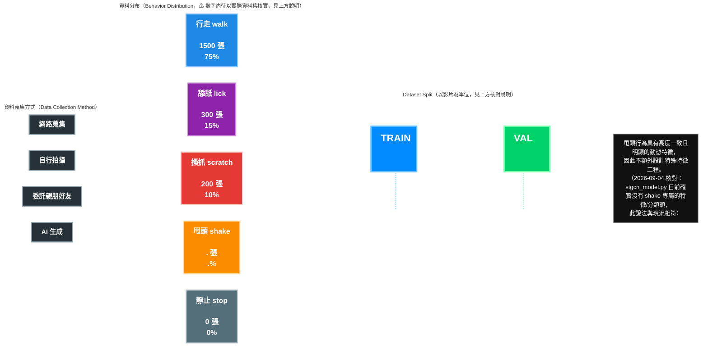

# 資料集切分示意圖（Dataset Split Diagram）

更新：2026-09-04（依實際程式碼核對修正：切分方式改為「僅 TRAIN/VAL 兩路、以影片為單位」，移除與程式碼不符的 TRAIN/VAL/TEST 三路影像切分；行為類別占比數字仍為待補資料，見下方「⚠ 尚未驗證」說明）

> [!IMPORTANT]
> **⚠ 尚未驗證 / 待補**：下方「行為分布」區塊各類別的張數與百分比（`1500/300/200/…`）目前是**未經查證的既有佔位數字**，本次核對範圍內沒有取得實際資料集（`skeletons/` 資料夾在本次核對環境中不存在），因此**沒有修改或杜撰這些數字**，僅原樣保留並在此註記其真實性尚待用實際資料集統計值確認，撰寫論文前務必重新核實。

> [!NOTE]
> **✅ 已核對並修正的部分：切分方式本身**
>
> 原圖上半部畫的是 **TRAIN／VAL／TEST 三路、以「張數（Images）」為單位、75%／15%／10%** 的切分，但這與 `cat_monitoring_system/tools/0_train_gcn.py`（`split_train_val_indices()`）與 `stgcn_config.yaml`（`TRAIN_TEST_SPLIT: 0.15`）的實際作法不符：
>
> - ST-GCN 訓練管線**只切成 TRAIN／VAL 兩路，沒有獨立的 TEST 集**。
> - 切分單位是**影片（video）**，不是張數／影格：每支骨架 JSON（一支影片）先整支歸入 train 或 val，之後才在各自集合內部切滑動窗序列，避免同一支影片的重疊視窗同時落在 train 與 val 造成資料洩漏（防 leakage）。
> - 切分比例由 `TRAIN_TEST_SPLIT: 0.15` 決定：**保留約 15% 影片作為 VAL，其餘約 85% 為 TRAIN**（非原圖的 75/15/10）。
> - 採用 `sklearn.train_test_split` 依「影片主要行為標籤」做 stratify（類別分層抽樣），`RANDOM_SEED=42`；若某類別影片數不足以分層則自動退回 random split；若某類別有 ≥2 支影片卻沒被分到 val，會自動從 train 移 1 支到 val，盡量讓每個可分類別在 val 都有代表。
>
> 下方 mermaid 圖已依此修正為兩路切分，僅標示核對過的切分**比例**，不附加未經驗證的影像張數。

---

## 補充：與程式碼對照的關鍵事實（2026-09-04 核對）

| 項目 | 圖中原內容 | 程式碼實際行為 | 依據 |
|---|---|---|---|
| 切分路數 | TRAIN / VAL / TEST 三路 | 僅 TRAIN / VAL 兩路，**無獨立 TEST 集** | `0_train_gcn.py: split_train_val_indices()` |
| 切分單位 | 「張（Images）」 | **影片（video）**，同一支影片的所有滑動窗序列必定落在同一路，防止 data leakage | 同上 |
| 切分比例 | 75% / 15% / 10% | **≈85% / ≈15%**（`TRAIN_TEST_SPLIT: 0.15`） | `stgcn_config.yaml` |
| 抽樣方式 | 未說明 | 依影片主要行為標籤做 stratify（類別分層），`RANDOM_SEED=42`；影片數不足時自動退回 random split；缺類別時自動從 train 移 1 支影片補進 val | `0_train_gcn.py: split_train_val_indices()` |
| 行為類別 | 行走／舔舐／搔抓／甩頭／暫定（5 類） | 與程式碼 `BEHAVIOR_PREFIXES`（`walk/lick/scratch/shake/stop`，共 5 類）一致；「暫定」已改標為「靜止 stop」，因為 `stop` 在目前程式碼中是正式定義、已有訓練模型使用的類別，不是尚未定案的暫定項目 | `stgcn_config.yaml: BEHAVIOR_PREFIXES` |
| 各類別張數/占比 | 具體數字（1500/300/200/…） | **無法從程式碼驗證**——這是資料集內容統計，不是程式邏輯，需要直接統計 `SKELETON_DATA_FOLDER` 底下的實際資料 | 本次核對環境無法存取 `skeletons/` 資料夾 |
