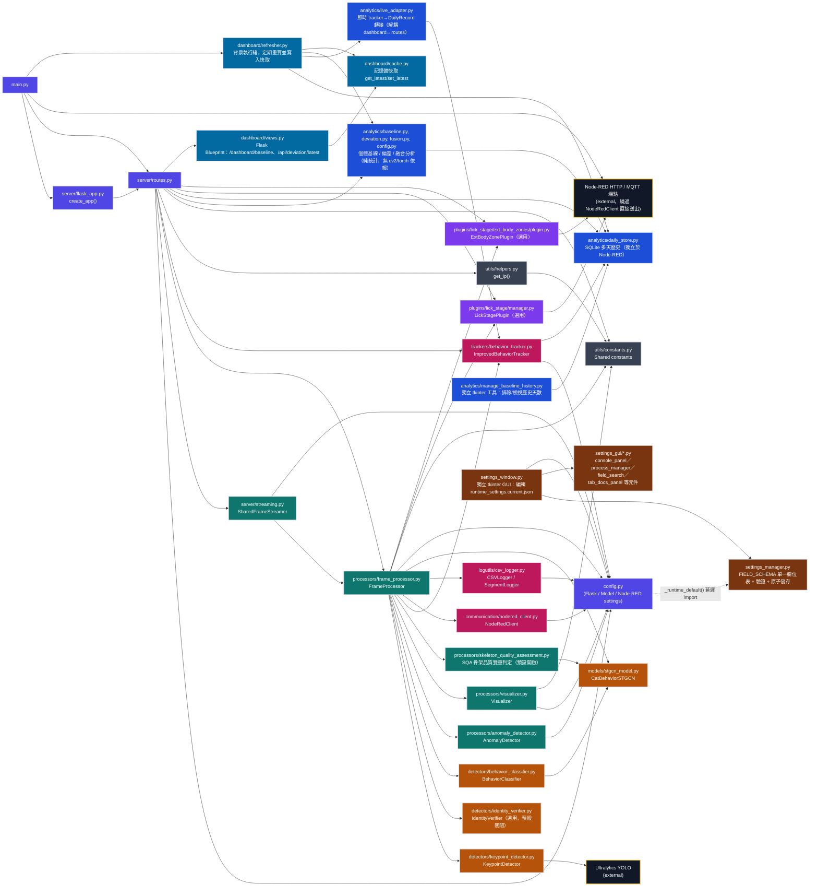

# 📘 模組責任畫分

> [!IMPORTANT]
> **本文件用途**
>
> 用一張 mermaid 架構圖 + 逐模組職責說明，回答「這個系統有哪些模組、誰負責什麼、彼此怎麼呼叫」。只描述「負責什麼功能」，不涉及演算法細節或程式邏輯——細節請參見對應原始碼或 `0_AI_專案導覽地圖.md`。
>
> 更新：2026-09-04（依程式碼核對；補上先前遺漏的 Analytics 完整套件、Dashboard、
> Identity Verification、Settings/GUI 四塊，並更新 mermaid 架構圖與模組群數量）。

---

## 🚀 30 秒快速看懂（TL;DR）

> [!TIP]
> ### 如果只看一頁，請看這裡
>
> - 🏗️ 全系統分 **11 個模組群**：Core Entry / Streaming / Processing / Detection-AI / Tracking-Logging / Communication / Analytics / Dashboard / Plugins / Settings-GUI / Utilities。
> - 🧠 核心編排者是 **`processors/frame_processor.py`**——串接關鍵點偵測、身分驗證、行為分類、異常偵測、SQA、追蹤、視覺化、紀錄、對外通報的完整單幀流程。
> - 🔌 **Plugins（LickStagePlugin / ExtBodyZonePlugin）是選用、可插拔的**，發生錯誤不影響主系統。
> - 🚨 **SQA 開關現況**：`SQAConfig.ENABLE_SQA_DUAL_JUDGMENT` 預設 **True（開啟）**，2026-08-11 確認為刻意變更。
> - 📊 **Analytics（個體化基線）與 Dashboard（唯讀展示頁）是獨立於攝影機管線的第二條資料流**：`BehaviorTracker` 跨日時把資料寫進 `analytics/daily_store.py`（SQLite），`dashboard/refresher.py` 背景執行緒定期讀出來算基線/偏差/融合分數，全程不依賴 Node-RED 有沒有開。
> - 🛠️ **Settings/GUI（`settings_manager.py` + `settings_window.py` + `settings_gui/`）是獨立於 Flask/main.py 的第二支入口**：獨立 tkinter 程式，編輯 `runtime_settings.current.json`（不是 `config.py`/`stgcn_config.yaml`），存檔後需重啟主程式才生效。

---

## 📖 如何使用本文件（標示說明）

| 標示 | 意義 |
|:---:|---|
| 🚨 | 必看、開關現況等容易過時的資訊 |
| 🧠 | 核心編排/原理 |
| 🔌 | 選用、可插拔模組 |
| 📌 | 本節結論 |
| 📎 | 延伸閱讀／相關檔案 |

---

## 🧭 快速導航（目錄）

1. [🗺️ 架構圖（mermaid）](#架構圖)
2. [📋 各模組功能總覽](#各模組功能總覽)
   - [Core Entry（核心進入點）](#core-entry核心進入點)
   - [Streaming（影像串流）](#streaming影像串流)
   - [Processing（處理管線）](#processing處理管線)
   - [Detection / AI（偵測與模型推論）](#detection--ai偵測與模型推論)
   - [Tracking / Logging（追蹤與紀錄）](#tracking--logging追蹤與紀錄)
   - [Communication（對外通訊）](#communication對外通訊)
   - [Analytics（個體化分析）](#analytics個體化分析)
   - [Dashboard（基線唯讀展示頁）](#dashboard基線唯讀展示頁)
   - [🔌 Plugins（選用、可插拔）](#plugins選用可插拔)
   - [Settings / GUI（執行期設定管理，獨立於 Flask 的第二支入口）](#settings--gui執行期設定管理獨立於-flask-的第二支入口)
   - [Utilities（共用工具）](#utilities共用工具)

---

## 架構圖

> 📖 **一句話摘要**：`main.py` 啟動 Flask，`routes.py` 組裝 `FrameProcessor` 並串起追蹤/分析/插件；`FrameProcessor` 是整張圖的中心節點，扇出到偵測、身分驗證、分類、異常偵測、SQA、視覺化、通訊、外掛全部模組。`analytics/`＋`dashboard/` 是與攝影機管線並行、獨立觸發的第二條資料流（`main.py` 另外啟動 `dashboard/refresher.py` 背景執行緒）；`settings_window.py` 則是完全獨立於 `main.py`/Flask 的第二支入口，只用來編輯 `runtime_settings.current.json`。

---

## 各模組功能總覽

> 本節僅描述各模組「負責什麼功能」，不涉及演算法細節或程式邏輯，細節請參見對應原始碼或 `0_AI_專案導覽地圖.md`。

### Core Entry（核心進入點）

- **main.py**：整個系統的啟動入口，支援「Server 模式」（啟動 Flask 伺服器）與「GUI 模式」（本機直接開窗顯示，不經過 Flask）兩種執行方式；負責啟動時的初始化流程，以及以 HTTP 直接通知 Node-RED「本機服務已上線」。
- **server/flask_app.py**：建立並組裝 Flask 應用程式本體，將所有路由註冊到伺服器上。
- **server/routes.py**：定義所有對外 HTTP 端點（影像串流、狀態查詢、行為紀錄查詢等），並負責組裝一次推論所需的完整處理管線（建立 FrameProcessor、註冊選用插件、串接分析模組）。
- **config.py**：全系統集中式設定檔，管理 Flask、YOLO、ST-GCN、Node-RED、行為追蹤、身分識別、日誌、SQA 等各面向的參數與開關。

### Streaming（影像串流）

- **server/streaming.py**：管理共用的即時影像串流緩衝，讓多個用戶端可以同時觀看同一份處理後畫面，不需各自重新推論。

### Processing（處理管線）

> 🧠 這一群是整張架構圖的中心——`FrameProcessor` 扇出到偵測/分類/異常偵測/SQA/視覺化幾乎所有模組。

- **processors/frame_processor.py**：整個系統的核心處理管線，負責串接「關鍵點偵測 → 行為分類 → 異常偵測 → 骨架品質雙重判定 → 追蹤 → 視覺化 → 紀錄 → 對外通報」的完整單幀處理流程，並管理選用插件的呼叫時機。
- **processors/anomaly_detector.py**：偵測貓咪行為或姿態的異常狀況（例如長時間無移動、姿態異常等），作為行為分類之外的輔助判斷。
- **processors/visualizer.py**：負責畫面上的所有視覺化呈現，包括骨架繪製、行為標籤、機率條、疊加資訊等。
- **processors/skeleton_quality_assessment.py**：以幾何規則對骨架品質進行輔助判定（脊椎中點偏移量、脊椎中點角度、身體軸線分數抖動），在 ST-GCN 分類結果之外提供「是否可信」的第二層判斷，失敗時不影響主流程。
  > 🚨 **開關現況**：`config.py::SQAConfig.ENABLE_SQA_DUAL_JUDGMENT` 預設 **True（開啟）**，2026-08-11 經使用者確認為刻意變更（原規劃是預設關閉、驗證足夠後再開啟，見 `docs/0_進度彙整.md` 3.6 節）。

### Detection / AI（偵測與模型推論）

- **detectors/keypoint_detector.py**：呼叫 YOLO 模型偵測畫面中貓咪的關鍵點座標；`single`/`multi` 兩種系統模式下行為不同——`single`（預設）每幀直接鎖信心最高的一隻、不做跨幀追蹤，`multi` 才會用 bbox IoU 延續鎖定同一隻貓。
- **detectors/identity_verifier.py（IdentityVerifier，選用，預設關閉）**：多貓同框時判定「哪隻是目標貓」，只讓目標貓的偵測進入後續行為分類/追蹤/CSV/Node-RED/個體化基線；只在 `SYSTEM_MODE="multi"` 且 `CatIdentityConfig.ENABLE_IDENTITY_VERIFICATION=True` 時生效，內部用 MobileNetV3-Small CNN 判斷（bbox 裁切 → softmax → 最近 N 幀多數決），fail-safe（模型載入失敗即整體停用，退回「偵測到的貓一律當目標貓」）。
- **detectors/behavior_classifier.py**：將一段時間窗口的關鍵點序列送入 ST-GCN 模型，輸出行為分類結果與信心分數。
- **models/stgcn_model.py**：定義 ST-GCN 模型結構本身，並提供關鍵點序列的缺值補插等前處理工具函式；會依載入的權重檔自動判斷關鍵點數量、輸入通道數等模型結構參數。
- **Ultralytics YOLO（外部套件）**：提供關鍵點偵測所需的底層物件偵測/姿態估計能力。

### Tracking / Logging（追蹤與紀錄）

- **trackers/behavior_tracker.py**：追蹤行為分類結果隨時間的變化，判斷行為段落的起訖，並做平滑化與去抖動處理。
- **logutils/csv_logger.py**：將行為紀錄、行為段落等資訊寫入 CSV 檔案，供後續分析與稽核使用。

### Communication（對外通訊）

- **communication/nodered_client.py**：封裝與 Node-RED 之間的持續性資料推送（行為分類結果、狀態更新等），由 FrameProcessor 在處理管線中呼叫。
- **Node-RED HTTP / MQTT 端點（外部）**：main.py 的上線通知，以及選用插件（LickStagePlugin、ExtBodyZonePlugin）的資料回傳，皆繞過 NodeRedClient、直接以 HTTP POST 或 MQTT 送出，是與 NodeRedClient 並行的另一條對外通訊路徑。

### Analytics（個體化分析）

> 📖 **一句話摘要**：這一群是與攝影機管線解耦的獨立分析套件——只依賴 `analytics/daily_store.py`（自己的 SQLite）與即時 tracker 資料，不讀、不寫 Node-RED 的任何 context 檔案。

- **analytics/baseline.py**：以近 30 天（`min_days=7`／`max_days=30`）每日歷史計算個體化基線——連續指標（walk/stop/lick/scratch 時長）算 mean/std/median/MAD/EWMA，稀疏計數（各行為次數）保留每日原始序列供 Poisson/NB 使用。
- **analytics/deviation.py**：計算今日資料相對基線的偏差——連續指標用 robust z-score（`(today − median) / (MAD × 1.4826)`），計數用 Poisson（或過度離散時 Negative-Binomial）尾機率換算 sigma-equivalent。
- **analytics/fusion.py**：把 deviation 結果依 Class A（舔舐/搔抓時長+次數，權重 45%，可單獨 override 等級）／Class B（甩頭/走動/靜止，25%）／Class C（節律/轉移，30%，目前仍由 Node-RED 傳入、Python 端固定為 0）加權融合成 0–100 風險分數與等級（Normal/Mild/Moderate/Severe）。
- **analytics/config.py**：`BaselineConfig`／`DeviationConfig`——上面三個模組的統計方法論常數（`EWMA_ALPHA`、`MAD_SCALE`、天數門檻、過度離散判定比例等）集中管理，每個常數逐項標註證據等級（【文獻支持】/【與 Node-RED 原版一致】/【工程慣例】/【數值穩定用途】），皆可用環境變數覆寫。
- **analytics/daily_store.py**：Python 端獨立的多天歷史持久化（SQLite，`daily_history` + `excluded_dates` 兩張表），`save_day()`/`load_history()`/`set_excluded()`/`load_excluded_dates()`；跟 Node-RED 自己的 `v2_daily_history` 是兩份完全獨立、互不依賴的歷史（同源比對用），由 `trackers/behavior_tracker.py` 跨日重置時寫入。
- **analytics/live_adapter.py**：中性轉接層——`today_from_tracker()` 把即時 `BehaviorTracker.get_today_stats()` 轉成 `compute_deviation` 要的形狀，`daily_record_from_dict()` 做型別轉換；存在目的是讓 `dashboard/refresher.py` 不需要 import `server/routes.py` 的私有函式（2026-08-29 解除雙向耦合）。
- **analytics/manage_baseline_history.py**：獨立 tkinter 小工具（不需要 Flask/攝影機/Node-RED 任一個在跑），列出 `daily_store` 全部歷史、逐筆勾選「採用/排除」，套用後立即重算一次基線證明生效。

### Dashboard（基線唯讀展示頁）

> 📖 **一句話摘要**：Python 端自己的基線展示頁，資料源與觸發時機都與 Node-RED 無關；由 `config.BaselineDashboardConfig.ENABLED` 總開關控制，關閉時整包不會被匯入。

- **dashboard/cache.py**：記憶體內快取最新一次基線/偏差/融合計算結果（`get_latest()`/`set_latest()`），全系統只有這一份。
- **dashboard/refresher.py**：背景 daemon thread（由 `main.py` 的 `run_server_mode()` 啟動，非 `create_app()`，避免測試互相汙染），每 `RECOMPUTE_INTERVAL_SEC`（預設跟隨 `NodeRedConfig.PUSH_INTERVAL`，約 2 秒）呼叫一次 `analytics/` 的 `compute_baseline`/`compute_deviation`/`compute_fusion`，資料源固定讀 `daily_store` + `live_adapter`，寫入 `dashboard/cache.py`。
- **dashboard/views.py**：Flask Blueprint，提供 `GET /dashboard/baseline`（唯讀展示頁）與 `GET /api/deviation/latest`（回傳快取結果的 JSON API）。
- **⚠ 與 `POST /api/deviation`（server/routes.py）的關係**：兩條觸發路徑並存、互不依賴——Node-RED 呼叫 `/api/deviation` 是給新舊引擎比對用，順便也會更新同一份 `dashboard/cache`；`dashboard/refresher.py` 的背景執行緒則完全不經 HTTP，直接在同一個 process 內計算，Node-RED 開不開都不影響 `/dashboard/baseline` 能不能看到最新資料。

### Plugins（選用、可插拔）

> 🔌 這一群全部是選用模組，發生錯誤不影響主系統運作。透過 `FrameProcessor.register_plugin()` 註冊，`FrameProcessor` 每幀呼叫已註冊插件的 `update()`/`draw_overlay()`/`close()`。

- **plugins/lick_stage/manager.py（LickStagePlugin）**：在 ST-GCN 已判定為舔舐行為時，進行舔舐動作的二階段細節分析（例如舔舐部位、持續時間等），並將結果對外回報；屬於可選擇是否啟用的附加模組，發生錯誤不影響主系統運作。
- **plugins/lick_stage/ext_body_zones/plugin.py（ExtBodyZonePlugin）**：偵測貓咪身體特定區域的接觸/停留狀況，並將統計結果寫入 CSV 或對外發布；同樣為可選擇是否啟用的附加模組，發生錯誤不影響主系統運作。
- 🚨 **兩者其實共用同一道 lick 閘門**：`frame_processor.py` 目前**所有**已註冊插件（不只 LickStagePlugin）都只在 `is_lick_behavior` 為真時才收到當幀真實的 `raw_kpts`/`kpt_conf`，否則收到 `(None, None)`——`register_plugin()`/`update()` 介面本身是通用協定，但實際只服務「舔舐行為觸發時才有意義」的用途；`ExtBodyZonePlugin` 的 docstring 雖自稱與 LickStagePlugin 完全獨立、互不依賴，實際仍受同一個 `is_lick_behavior` 閘控，非舔舐行為時同樣收不到真實關鍵點。

### Settings / GUI（執行期設定管理，獨立於 Flask 的第二支入口）

> 🧰 這一群完全不受 `main.py` 啟動——是操作者手動執行的獨立 tkinter 程式，用來編輯 `paper/runtime_settings.current.json`（執行期 JSON 覆寫層），**不是** `config.py` 原始碼、也不是 `stgcn_config.yaml`；存檔後不會熱重載，需重啟主程式（`main.py`）才會套用新值。

- **settings_manager.py**：`FIELD_SCHEMA` 是唯一的欄位對照表（dotted JSON key ↔ 環境變數名稱 ↔ `(class, attribute)` ↔ 型別 ↔ 驗證規則），提供 `runtime_settings.current.json` 的載入／合併／驗證／原子寫入（含 `.previous.json` 自動備份）；刻意不 import `config.py`，避免循環依賴。`STGCNTrainingConfig` 與 `STGCNConfig.SEQUENCE_LENGTH`/`FEATURE_MODE`/`NUM_CLASSES` 刻意不出現在 `FIELD_SCHEMA`，GUI 因此看不到、也存不了這些欄位。
- **settings_window.py**：獨立 tkinter GUI 主視窗，依 `FIELD_SCHEMA` 自動長出分頁與欄位列（新增可調欄位只需改 `settings_manager.py`，不用碰這支 GUI）；同時整合啟動/停止 `main.py` 子行程、內嵌主控台輸出面板、欄位搜尋、說明文件面板等操作面板。
- **settings_gui/*.py**：`settings_window.py` 的元件庫——`console_panel.py`（內嵌主控台輸出/log 面板）、`process_manager.py`（啟動/停止 `main.py` 子行程、`any_running()` 狀態查詢）、`field_search.py`（欄位搜尋列）、`tab_docs_panel.py`（即時解析並顯示 `docs/設定分頁模組與核心函式對照表.md` 對應段落）、`style.py`（共用顏色/字型常數）、`ui_state.py`、`image_popup.py`。
- **identity_trainer_window.py**（`paper/` 根目錄，被 `settings_window.py` import）：獨立的貓咪身分辨識 CNN 訓練工具視窗，與 `cat_monitoring_system/tools/cat_identity/` 訓練工具鏈整合，不在本文件詳述範圍（見 `0_AI_專案導覽地圖.md` 3.6 節工具腳本清單）。

### Utilities（共用工具）

- **utils/constants.py**：集中定義全系統共用的常數（行為類別、標籤對照表等）。
- **utils/helpers.py**：提供跨模組共用的小工具函式，例如取得本機 IP、行為名稱轉換、影像來源判斷等。

> 📌 **本節結論**：11 個模組群裡，Core Entry 負責啟動與路由、Processing 是執行核心、Detection/AI 是模型本體、Tracking/Communication 負責統計與推送、Analytics/Dashboard 是與攝影機管線並行的個體化基線分析與展示、Plugins 是可拔插的加值功能、Settings/GUI 是獨立於 Flask 的設定管理入口、Utilities 是共用小工具——彼此依賴關係看上面的架構圖。

---

## 📎 延伸閱讀／相關檔案

- `docs/0_AI_專案導覽地圖.md` — 更詳細的路徑/職責/呼叫關係說明，含工具腳本清單。
- `docs/0_進度彙整.md` — 3.6 節有 SQA 的完整動機、指標定義與校準現況。
